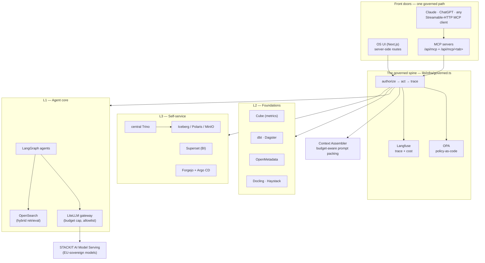

<!--
  SPDX-License-Identifier: Apache-2.0
  Copyright 2026 Borek Data Ventures UG (haftungsbeschränkt)

  SINGLE SOURCE for the Sovereign Agentic OS guide.
  Edit this file when the OS changes, then run scripts/build-docs.sh to refresh the PDF.
  {{DATE}} and {{GIT_COMMIT}} are substituted at build time from `git log -1`
  (see scripts/build-docs.sh and docs/README.md). The committed .md keeps the placeholders.
  The PDF design (cover, fonts, layout) lives in docs/assets/guide.css.
-->

\newpage

# The one-paragraph version

The **Sovereign Agentic OS** is a self-hostable, EU-residency operating system for your
data, knowledge, agents and software — a single **governed** stack where every action, taken
by a person *or* by an AI, runs **as you**: OPA-policy-checked, row- and column-secured, and
Langfuse-audited. It assembles roughly two dozen best-in-class, permissively-licensed
open-source tools — a Trino/Iceberg lakehouse, a Cube semantic layer, OpenSearch retrieval,
a LiteLLM model gateway to sovereign EU models, LangGraph agents — into one operating model
you learn once and apply everywhere. Its promise is simple and, we think, important: it gives
AI **real, safe hands on your data**. The web UI and the AI (over MCP) travel the *exact same
governed path* — there is no privileged back door — so you can hand an agent the keys to your
lakehouse and know, provably, that it can never do anything you couldn't do yourself.

> **Where to go next.** Curious what it feels like? Read *The guided tour*. Want to run it?
> Jump to *Quickstart*. Coming from a governance or security background? Start with *The
> governance model*. Contributing code? *How to contribute* and `os-ui/ARCHITECTURE.md` are
> your on-ramp.

\newpage

# Why this exists

For two years the industry has been stuck on the same tension. **Agents are only useful when
they can act** — read the warehouse, write a table, ship an app, call a tool. But the moment
an agent can act, the honest questions arrive: *Whose identity is it running as? What is it
allowed to touch? Where did the data go? Can I prove, after the fact, exactly what it did?*
Most stacks answer these by wrapping an autonomous agent in ad-hoc guardrails bolted on after
the fact — and by shipping your prompts and data to a US-hosted model.

The Sovereign Agentic OS answers them structurally, with three ideas doing all the work:

1. **One governed path for humans and AI.** Every write — from a button click, from a tab's
   built-in assistant, from Claude or ChatGPT over MCP, or from an autonomous agent — flows
   through the *same* function: `authorize → act → trace`. Governance isn't a feature you can
   forget to turn on; it's the only road in.

2. **Sovereignty is the substrate, not a badge.** The production target is **STACKIT**
   Kubernetes with STACKIT Object Storage in **EU01 / Deutschland Süd**, and model calls
   route to **STACKIT AI Model Serving**, so prompts and completions never leave the EU
   boundary. Default-deny egress means an agent has *no* raw internet unless you grant it.

3. **Permissive open source, end to end.** Every bundled component is Apache-2.0 / MIT / BSD /
   PostgreSQL licensed — full auditability, no proprietary lock-in, the right to host and
   modify it forever. The core is **Apache-2.0**.

## Who it's for

- **Regulated organizations, the public sector, and EU enterprises** that need data residency,
  a complete audit trail, and zero dependency on US-controlled cloud or hosted LLMs — but
  still want production-grade agentic workflows.
- **Data and platform leaders** who want *one* place for the lakehouse, the semantic layer, the
  knowledge spine, BI, and software delivery — instead of a dozen disconnected tools and a
  governance story stitched across all of them.
- **Curious engineers and OSS contributors** who want to see how a governed agent runtime is
  actually built — and to extend it, one clean tab-module at a time.
- **Data Masterclass participants** building real agentic systems on the *same* production
  components used in the field, not a teaching fork.

## The problems it solves

| The tension | How the OS resolves it |
|---|---|
| **Governance vs. agent autonomy** | Agents are genuinely autonomous *inside* a policy envelope. Every tool call is OPA-authorized; anything out of scope doesn't fail silently — it queues to a human as an approval card. |
| **Sovereignty vs. capability** | The full stack runs in your EU region on open source. Models are sovereign (STACKIT) yet swappable; nothing phones home. |
| **Ten tools vs. one source of truth** | One lakehouse, one semantic layer, one knowledge spine, one identity, one audit — so BI, agents and dashboards can never disagree about "revenue." |
| **Demos vs. production** | The same Helm chart runs on a laptop (`kind`) and on a sovereign STACKIT cluster. The only difference is a values choice per backend. |

\newpage

# The operating model — learn it once

One idea ties every screen together. Internalize it here and the whole product reads the same.

## Everything is a governed artifact

Whatever you make — a dataset, a knowledge workflow, a file, an agent, an app, an ML model, a
metric, a connection, a dashboard — is an **artifact** with the same four attributes:
**owner · domain · type · visibility**. Whatever its type, it travels one lifecycle:

> **Create → Document → Use → Promote** — authored in the UI (which scaffolds the *real* tool
> underneath: a dbt model, a Cube metric, a Forgejo repo, a KServe service), preview-first,
> cataloged and audited.

## The sharing ladder

Visibility widens **one rung at a time**, and each move is strictly **two-step** — the person
who *triggers* a promotion is never the person who *approves* it:

| Visibility | Meaning | Who triggers | Who approves |
|---|---|---|---|
| **Personal** | the creator only — the default for drafts | — | — |
| **Shared (domain)** | usable across the owning domain | the **owner** files a promotion request | a **Builder+ of that domain** |
| **Marketplace (certified)** | discoverable and importable by *other* domains | a **Builder / Domain admin** — the domain vouches for it | the **platform Administrator** — the platform accepts it |

**Approving *is* the action.** On approve, the platform executes the governed effect — for a
dataset, a physical publish; the tier flips only once it verifies — and writes the audit.
Nothing enters the governed store without **documentation + passing checks**: a transparency
gate that turns green only when an artifact is documented and in the lineage graph.

## Four roles, assigned per domain

The ladder is exactly **creator < builder < domain_admin < admin**.

| Role | What they do |
|---|---|
| **Creator** | the base role — creates and runs their **own** artifacts (Personal by default) and consumes anything Shared or Certified. Files promotion requests; cannot approve. |
| **Builder** | the domain **approver** — everything a Creator can, plus review/approve domain promotions, deploys, knowledge and connections. An approver, *not* a people-admin. |
| **Domain admin** | everything a Builder can, plus administering the users of their **own domain(s) only** — invite, edit, assign roles **up to Builder**. Never mints another Domain admin. |
| **Administrator** | tenant-wide — the only role that appoints **Domain admins**; sets policy, certifies to the Marketplace, sets cost caps; runs the Admin section. |

Roles are assigned **per domain** and **compiled to OPA**, so a person who is a Builder in one
domain and a Creator in another sees exactly the right controls in every tab, instantly.

## Every assistant acts, and acts as *you*

Each tab has a built-in assistant, and there is one **overarching assistant** — **Ask the OS**
— present on every tab. Neither is a chat box. Each runs one loop: **PLAN** with the reasoning
model, then **ACT** in a bounded tool-calling loop with the worker model — calling that tab's
governed tools, which are the *same* OPA-authorized, Langfuse-traced functions the UI uses.
Crucially, **Ask the OS is a client of the OS's own MCP server**: it dispatches through the
exact same governed path (`handleRpc`) that Claude Desktop uses, under *your* delegated
identity. It inherits identical guardrails — role floor, approval gates, OPA/RLS, audit — and
it is transparent: each answer lists the governed tools it invoked, and if governance *blocks*
a call it says so plainly. There is **no privileged side-channel**.

\newpage

# The guided tour

Open the OS in a browser and you land on a left sidebar organized into named sections. Here is
the whole map, in sidebar order — each surface in a few vivid sentences, with what you *do*
there.

## Entry

- **Home — the golden-path launcher.** The warm front door after you pick a domain. An
  illustrated launcher of the golden paths (Data, Knowledge, Agents, Software, Science,
  Metrics, Dashboards, Big Bets, Marketplace, Connections), each card with a role-aware
  action. It *only* orients and routes — the live view lives one click away in Cockpit.
- **Cockpit — what's moving, what needs you.** A persona-ordered live overview: a pulse strip
  (*Needs you · In progress · Your items · Spend* vs. cap), your work-in-progress, and a
  scannable "top items, by type" board. Cockpit *reads and routes* — it never recomputes
  another tab's numbers and never bypasses governance.
- **Marketplace — consume across domains.** The *Consume* counterpart to every tab's *certify*
  step: discover and reuse Administrator-certified products of every type across the tenant.
  Importing is a **governed grant**, not a copy — the default is read-in-place, under your own
  identity and row-level security.

## Plan

- **Strategy — pillars, value and adoption.** Where the company plans its agentic
  transformation, in exactly three calm sections: **Big Bets** (your strategic pillars, each
  with a big value target), **Self Service** (how broadly your people build for themselves),
  and **Foundations** (the certified asset base every bet builds on).
- **Big Bets — initiative roadmaps.** A strategic AI bet as a **goal + dated roadmap** built
  from real artifacts across the platform, linked up to a Strategy pillar. Status derives
  *live* from each artifact's real lifecycle; the roadmap rolls up on-track / at-risk.
- **MCP** *(Builder+)* — the setup surface for connecting external AI clients over MCP.
- **Tutorials.** One illustrated, hands-on tutorial per golden path — reached from Home or a
  tab header — that can spotlight the real controls and let you practice in a sandbox before
  doing it for real.

## Context

- **Knowledge — the domain's operating manual.** Human-authored know-how: general domain
  knowledge plus a **workflow** per business process (steps · rules · tacit), made retrievable
  by a knowledge agent behind document-level security. Mark a decision rule **hard** and it
  compiles into an OPA guardrail.
- **Files — a calm governed drive.** Any unstructured file — documents, images, audio, video —
  uploaded and auto-indexed (parse → embed → hybrid OpenSearch) so agents can search and cite
  it. Governed exactly like Data; *"Use as"* distils a file into Knowledge or Data.
- **Data — datasets, refined and governed.** Turn a plain-language flow — refine a dataset
  **Bronze → Silver → Gold**, then share it — into real governed artifacts (a dlt pipeline,
  dbt models, a Cube cube), with no YAML. Then **Talk to your data**: governed NL→SQL, one
  validated read-only `SELECT`, executed under your row filters.
- **Connections — governed bridges to outside systems.** A Connection is `credentials +
  endpoint + a set of governed tools`, never a raw pipe — used to bring data in and to expose
  external APIs/MCPs as tools. You grant **use**, never the token. For teams already running a
  lakehouse elsewhere, an admin-enabled **external-warehouse** connector federates it through
  central Trino as a governed catalog — AWS Glue/Athena, Snowflake, BigQuery, Databricks/Delta,
  and (experimental) Microsoft Fabric/OneLake — so you can query it in place under the same OPA
  path, or import a core table as a governed data product into the sovereign lakehouse.
- **Metrics — one number, everywhere.** The KPI semantic layer. Define "Revenue" once and it
  resolves to the *same* number in the explorer, in dashboards, and in an agent's `metrics`
  tool — each under the viewer's own row-level security.

**Talk to any Context tab.** Every tab above carries a read-only **"Talk to X"** copilot. It
builds a security-scoped overview of what *you* can see on that tab, runs the tab's own governed
retrieval **as you** (Data → NL→SQL, Knowledge → knn retrieval, Files → file search; Metrics and
Connections grounded on their catalog), and packs it within the model window via the [Context
Assembler](#the-context-assembler). Answers arrive with the model's **reasoning shown separately**
(a collapsible "thinking" panel), real citations, and a "what ran" disclosure — and it degrades
honestly rather than inventing an answer when retrieval comes back empty.

## Build

- **Agents — compose, govern, run.** One page where a domain's **agent systems** (instructions
  + tools + memory) are composed three equivalent ways — a React-Flow graph builder, Monaco
  YAML editing, or a chat assistant — then granted resources, built (*Build = execute +
  verify*), and run. Every call routes through **LiteLLM → OPA → Langfuse**. Each **data grant**
  can target the **medallion layer** the team reads — Bronze, Silver, or Gold — and the picker
  only offers layers that are actually built, defaulting to the highest (Gold, the curated
  default). The chosen layer is enforced when the team discovers and profiles that dataset.
- **Software — build governed apps, sovereign.** Describe an app in a Claude-style build chat;
  the agent writes and commits code to an in-cluster **Forgejo** repo (no GitHub, no tokens,
  your code never leaves). *Request deploy* assembles a review card — security scan, resource
  envelope, diff — that a human Builder decides. The in-cluster runner provisions a real
  Deployment + Service + Ingress with a live per-app URL.
- **Science — classic ML** *(opt-in, Layer 4)*. Take traditional ML (regression, forecasting,
  clustering — *not* LLMs) from a governed data product to a deployed model-as-service, exposed
  as both a REST `predict` API and a `predict` MCP tool. Off by default; GPU is cost-gated.
- **Dashboards — governed BI.** Apache Superset dashboards built read-only on governed Cube
  metrics, so BI and agents can never disagree. A server-minted guest token carries the
  viewer's RLS, so a shared dashboard still shows only your rows.

## Monitor & Admin

- **Governance** *(Builder+)* — the control plane: one Approvals inbox for every side-effectful
  action, the consolidated policy view, the hash-chained audit, cost caps, and Users & access.
- **Monitoring** *(Builder+)* — artifact observability: trace runs (Langfuse), watch spend vs.
  caps, and surface pipeline + model drift — scoped to your identity, strictly read-only.
- **Components** *(Admin)* — the one operator surface: every platform service with live health
  and version, and one-click same-origin consoles (Superset, Forgejo, Dagster, …) via SSO.
- **Admin / Terminal / Query / About** *(Admin)* — the tenant control room (domains, users,
  models, egress, cost), a developer terminal and SQL/Cube console, and the license inventory.

\newpage

# The golden paths — walked end to end

Abstract governance is easy to nod at and hard to feel. So here is the OS at work on a single,
concrete story that runs through the whole guide: **Northpeak Commerce**, a fictional
mid-sized European omnichannel retailer, whose team wants to optimize marketing-campaign
budget with agents. (It's the exact case study seeded into the live teaching cohort — see *The
live teaching cohort* — so every step below is a real, governed flow, not a mock-up.)

## Golden path 1 — Data: from a CSV to a queryable metric

Meet **Mara**, a Creator in the `sales` domain. She has a `campaign_master.csv`.

1. **Create & ingest (Bronze).** In **Data**, Mara creates a dataset and uploads the CSV. Her
   bytes land as a real Iceberg table in her *own* per-user schema
   (`iceberg.personal_mara.bronze_campaign_master`) — registered only when apply **and** a
   governed verify both pass. No fake green ✓.
2. **Clean it (Silver).** She presses *Turn into Silver* with guided ops (cast types, drop
   dupes, set the key). The OS compiles **one** allowlisted CTAS into her schema and runs it
   as her — OPA masks every read.
3. **Make it ready (Gold).** *Turn into Gold* joins the campaign, margin and CAC datasets on a
   reconciled key. On success the Gold **auto-registers as a Cube model**.
4. **Document & promote.** Documentation is the gate: Mara adds a description and a tag, then
   files a promotion request. She's a Creator — she *cannot* approve her own work.
5. **A Builder approves — and the publish runs.** **Ben**, a Builder in `sales`, approves.
   The approval independently verifies the physical gold materialized in the domain schema
   (`iceberg.sales.gold_campaign`), then flips the tier and writes the audit.
6. **One number, everywhere.** In **Metrics**, `revenue`, `aov`, `conversion_rate` and
   `churn_rate` now resolve on the Gold cube, sliceable by `region`, `product` and `date` — no
   SQL. Anyone who asks "what's revenue?" — a dashboard, an agent, the explorer — gets the same
   answer, under their own row filters.
7. **Talk to it.** Mara opens **Talk to your data** and asks a plain-English question. The
   model is shown only datasets she can see, generates one validated read-only `SELECT`,
   executes it through governed Trino under her masks, and answers grounded only in the
   returned rows.

*(This entire path is also available over MCP — `create_dataset` · `ingest_dataset` ·
`transform_silver` · `build_gold_join` · `document_dataset` · `request_promotion`, then a
Builder's `approve_promotion` runs the physical publish. Same governed functions, no back
door.)*

## Golden path 2 — Knowledge: capturing how the work is done

Northpeak's campaign playbook lives in people's heads. Let's make it retrievable.

1. **Author a workflow.** In **Knowledge**, Ben authors a *"Campaign budget decision"*
   workflow: ordered **steps** (each owned by a Human / Software / Agent actor, with
   inputs/outputs), **rules**, and **tacit** know-how — the gotchas and the "why behind the
   why," which get indexed as first-class retrieval units.
2. **Mark a hard rule.** *"CAC above target for 14 days ⇒ never INCREASE budget"* is marked
   **hard**, so it compiles into an OPA guardrail an agent must respect.
3. **Index & verify.** `index_knowledge` chunks and embeds the workflow into OpenSearch; a
   quick `search_knowledge` confirms it surfaces. Indexing is *not* automatic — this step is
   what makes it findable.
4. **Publish.** A Builder publishes it Shared, so every domain agent can ground on it. Tacit
   notes carry provenance, and agents must cite the source.

## Golden path 3 — Agents: a governed team with real hands

Now the payoff. Mara builds an agent team that reads the campaign data, respects the playbook,
and recommends a budget next-best-action.

1. **Compose.** In **Agents**, Mara drags an *analysis* agent and a *recommendation* agent onto
   the React-Flow canvas (or edits `system.yaml` directly — same versioned file). Each agent's
   `AGENT.md` grounds it in the published campaign knowledge.
2. **Grant resources + tools.** She grants the system the shared campaign datasets, the
   knowledge workflow, and the `query_data` / `search_knowledge` tools. A validation gate must
   pass; a sub-agent's grants are always a strict subset of the system's.
3. **Pick models.** The single **Auto / Reasoning / Execution** toggle shows the real gateway
   model names (`sovereign-reasoning`, `sovereign-default`) with an internal/external badge.
4. **Build = execute + verify.** *Build* runs the compiled system and checks it — every call
   routed **LiteLLM → OPA → Langfuse**.
5. **Run — governed all the way down.** *Run* executes the team **as Mara**. Every tool call
   the team makes dispatches through the same governed door as her own MCP calls: grant-scoped,
   OPA-pre-gated, role-floored. The team returns *INCREASE / CUT / HOLD budget for X days +
   reasoning*. A write pauses for approval and enqueues in **Governance** — the agent is
   *propose-don't-commit* by default.
6. **Promote.** Once it's good, Mara files a promotion; a Builder shares it so the whole domain
   can *run* it (but not edit it).

**Two runtimes, one governed plane.** A system picks **LangGraph** (the default — structured,
replayable, human-in-the-loop) or the autonomous **Hermes** runtime for long-running work that
compounds (persistent memory + self-improving skills). Both share one governed plane: Hermes
reaches models **only** through LiteLLM and tools **only** through the same Platform MCP, so OPA
still gates every call, Langfuse traces it, and code runs in a kernel-isolated sandbox (Kata
microVM or gVisor — never host-local). Hermes ships **off by default**.

## Golden path 4 — Big Bets & Strategy: tying it to value

Finally, the work connects to the plan. In **Strategy**, an Administrator defines a pillar —
*"Marketing efficiency"* — with a value metric (say, EBIT, or a custom "CAC reduction %"). In
**Big Bets**, Ben creates a *"Campaign budget optimization"* bet under that pillar, sets a
target and a go-live date, and attaches the real artifacts built above — the Gold dataset, the
metric, the agent team, the app. Status derives **live** from each artifact's real lifecycle,
so the roadmap flags itself on-track or at-risk without anyone updating a spreadsheet. The
pillar's value can be tracked as a governed Cube metric or entered monthly — either way it
feeds the pillar's history chart.

\newpage

# The governance model — the honest details

Governance here is not a policy PDF; it's executable, and it's the same for a click and for an
agent. Four guarantees hold throughout.

## Run-as-user, always

The per-user token (UI session or MCP token) carries your identity. The **role floor is
re-checked from the live session on every call** — never trusted from the request body. An
agent runs as its owner; Ask the OS runs as you. Nobody and nothing gets a privileged path.

## OPA tool gates

A principal may invoke a tool only if **granted**; unknown principals and ungranted tools are
denied. Internet access is an explicit grant — `web_fetch` is ungranted by default, and the
web is returned as **sanitized data, never instructions**. Policy checks **fail closed**: if
OPA is unreachable, the gate *denies* (with an explicit `opa-unreachable` marker) rather than
waving the call through.

## DLS — row & column security, independent of tier

Document- and row-level security filter what you see **at query time, regardless of tier**.
Promoting an artifact to a wider tier **never** widens row access — two viewers of the same
Shared dataset see different rows. Every data-proxy route requires a session and scopes results
to the caller's domains.

## Two policy layers, one inbox

- **Tenant guardrails** an Administrator sets and domains cannot override: default-deny egress,
  no plaintext secrets to agents, no cross-domain data without a grant, a model allowlist.
- **Domain policy** Builders set within them.

High-stakes actions don't fail silently — they queue as a **card** in the **Governance**
inbox, where *approving is the action*: on approve the platform runs the effect (an Argo
deploy, a policy grant, an egress allowlist entry, a promote, a queued run) and writes the
hash-chained audit. Three planes stay deliberately separate and cross-link rather than
duplicate: **Admin** *configures* the tenant, **Governance** *decides and records*, and
**Monitoring** *observes the artifacts*.

## Archive, delete, and version history

Every artifact carries the same lifecycle controls, and only its owner (or an in-domain Admin)
may use them. **Archive** is a reversible soft-hide (a running agent is also stopped);
**Delete** is available only on already-archived items, behind an explicit confirm; **Version
history** snapshots the prior state on every meaningful edit, and *restore* itself snapshots
the current state first — so you can always undo a restore. One reusable helper
(`lib/core/versioning.ts`) gives every store identical behaviour, and history is mirrored to
OpenSearch so it survives redeploys.

\newpage

# The architecture

The platform assembles ~two dozen open-source components you can reason about — and enable — in
layers. On top sits the **OS UI**, the single front door; beside it, the **MCP servers**, the
governed front door for AI.



## The layers

- **Layer 1 — Agent core.** The runtime: **LangGraph** agents calling **LiteLLM** (the one
  model + tool gateway, with per-key access control and cost caps), every action traced in
  **Langfuse**, retrieving over **OpenSearch** (hybrid vector + lexical — no separate vector DB).
- **Layer 2 — Foundations.** Turning raw data and knowledge into governed products: **OPA**
  (policy at the tool boundary), **Docling** (parsing), **Haystack** (RAG), **Dagster**
  (orchestration), **dbt** (transforms), **Cube** (the metrics layer), **OpenMetadata**
  (catalog + lineage).
- **Layer 3 — Self-service.** Query, visualize, ship: the **Iceberg** lakehouse
  (**Polaris** catalog, **MinIO** object storage) with **central Trino** as the *one* governed
  query engine, **Superset** for dashboards, and in-cluster **Forgejo + Argo CD** for software
  delivery (git → CI → GitOps).
- **Layer 4 — Science / ML.** Classic ML — **JupyterHub**, **MLflow**, **Featureform**,
  **KServe** — *opt-in and off by default* (heavier, GPU-oriented).
- **Security baseline** spans every layer: default-deny egress through a single proxy
  chokepoint, a governed `web_fetch`, OPA tool authorization, externalized secrets, hardened
  pods.

## The lakehouse & semantic layer

An upload becomes a real **Iceberg** table in your per-user schema; Silver and Gold builds run
one compiled CTAS each; everything is queried through **central Trino** under your identity, so
there is exactly one governance boundary for data. **Polaris** holds the catalog metadata in a
durable relational-JDBC metastore (so the warehouse registration survives restarts), and
**MinIO** keeps the data files on a PVC. Above the lakehouse, **Cube** is the semantic layer:
a promoted Gold dataset auto-registers as a queryable Cube model, and a `define_metric` call
adds named measures — so "revenue" has one definition that BI, agents and the explorer all
resolve identically.

## Models & the gateway

Every model call goes through **LiteLLM** — the one gateway that enforces the allowlist,
per-key spend caps, tracing and graceful back-pressure. Inference runs on **STACKIT AI Model
Serving**, an EU-sovereign, pay-per-token, three-tier set that an Administrator configures in
**Admin → Models & Providers** (a single live-sourced store; the three below are the helm
defaults — the OS is admin-configurable, not hardcoded to any provider):

| Role | Helm-default model | LiteLLM name |
|---|---|---|
| **Reasoning / planning** (the PLAN phase) | `Qwen3-VL-235B-A22B-Instruct-FP8` | `sovereign-reasoning` |
| **Standard / worker** (tool-calling, coding, chat) | `gpt-oss-20b` | `sovereign-default` |
| **Embeddings** (4096-dim) | `Qwen3-VL-Embedding-8B` | `sovereign-embed` |

STACKIT usage draws on one shared **€250/week** budget; once exhausted the gateway returns a
graceful HTTP 429 rather than failing hard, and resets weekly.

## The Context Assembler

Agents that read real data hit real context limits. The **Context Assembler**
(`lib/infra/context/`) is a budget-aware prompt builder: a per-model window registry (with
reserved output, admin/env-overridable), tool-result **compaction** (row-sets → header +
sample + "…N more"; long text → head/tail), and a greedy pinned-first pack that **guarantees
the prompt never exceeds the model window**. It's wired into the single-agent harness, the
multi-node graph handoff (each node hands on an assembled summary, not the full transcript),
*and* Ask the OS — which is what lets an agent discover and query real tables without blowing a
200K window.

## The MCP front door

The platform exposes itself as **governed MCP servers**, live end-to-end at
**`https://agentic.datamasterclass.com/api/mcp`** — one cross-tab server plus per-tab servers at
**`/api/mcp/<tab>`** (`software`, `data`, `knowledge`, `agents`, `files`, `metrics`,
`dashboards`, `bigbets`, `science`), each shipping a token-minimal `CONTEXT.md`. Around
**55 governed tools** ship — reads, writes, and read-back parity — so an external client can
build the entire Data → Metrics → Agents flow above. Every tool delegates to the **same
library function the UI calls**; promotion-class actions stay Builder/Admin-gated; and every
failure returns a typed, model-readable `{ code, reason, hint }` so a client can self-correct.

## Durability

Every user-facing in-process store mirrors to **OpenSearch** through one shared core
(`lib/infra/os-mirror.ts`): write-through on change plus hydration on boot, so artifacts
survive redeploys and node-rolls. On STACKIT a three-tier backup system (nightly Postgres
dumps, nightly off-cluster Velero volume backups, and a pre-upgrade backup gate) protects the
stores themselves — practiced with a restore-drill runbook, with honest documentation of what
is *not* protected.

\newpage

# Quickstart — run it

## Locally, in one command

```bash
# prereqs: docker (running), kind, helm, kubectl  ·  ~14 GB RAM / 6 CPU free
./install.sh            # press Enter through every prompt
```

Pressing **Enter** through every prompt gives the **fully self-contained** install: every
backend runs inside the chart and a tiny local model answers model calls — nothing external,
no API key. `install.sh` creates the `kind` cluster if needed, builds and loads the images,
installs the chart, seeds the demos, and prints the front door and demo logins.

```bash
./install.sh --defaults     # non-interactive, all bundled (CI / quick)
./install.sh --uninstall    # remove the release (keeps the cluster)
```

## Open the front door

```bash
kubectl -n agentic-os port-forward svc/os-ui 8080:3000   # → http://localhost:8080
```

Every surface calls the in-cluster backends through **server-side API routes**, so credentials
never reach the browser. Locally there's no login; on a real deployment you sign in with your
Ory identity. The stack's operational console is embedded at **Platform → Components** — there's
no separate admin service to run.

## Try the seeded demos

Four end-to-end demos ship seeded, so the system proves itself the moment it's up: **ask the
RAG agent** (retrieve → generate → trace), **query the lakehouse** (the governed `query` tool
over central Trino), **build a dashboard** in Superset, and **ship software** (push → Forgejo CI
builds an image → Argo CD redeploys). Each has a one-card launcher on **Home**.

## Deploy to your cloud (STACKIT)

The same chart runs the full Layer 1–4 stack on a sovereign STACKIT cluster; switching a backend
to a managed service is only a values choice. Provision an SKE cluster + Object Storage + a load
balancer + DNS, bootstrap the in-cluster prerequisites, point the OS at managed backends in
`values.stackit-managed.yaml`, then:

```bash
helm install agentic-os charts/sovereign-agentic-os -n agentic-os --create-namespace \
  -f values.stackit-managed.yaml -f values.generated.yaml
```

Full, verified steps live in the **Reference** below and in
`docs/stackit-deployment-guide.md`. Rough cost: **€450–670/mo** for L1+L2 at typical sizing;
scale the node pool to zero between sessions (storage + IP persist at ~€16–20/mo).

## Connect from Claude or ChatGPT (MCP)

Point any Streamable-HTTP MCP client at **`https://agentic.datamasterclass.com/api/mcp`** (or
open any tab's **"Connect your AI Tool via MCP"** button for a one-click import link). The
server uses managed OAuth (client-id-metadata-document pattern): your client fetches the
metadata, you approve once at the OS consent screen, and it receives a 180-day access token
held in the client — never in the OS. From then on **every tool call runs as you** — role
floor re-checked from the live session, OPA-authorized, DLS-scoped. First stop, always:
`whoami` and `list_capabilities`.

\newpage

# How to contribute

The OS UI is where most contribution happens, and it's built to be joinable. One rule governs
the whole layout: **everything is either a tab, infrastructure, or core.** Learn one tab and
you can work on any tab, because every tab is shaped the same way.

## The three layers

Dependency direction is strict and one-way: **`<tab>` → `infra` → `core`.**

- **`lib/core/`** — cross-cutting primitives (session, config, auth, scopes, lifecycle,
  versioning, the artifact model, nav). No tab logic, no external IO.
- **`lib/infra/`** — the governed spine + every external-service client. The *only* layer that
  talks to OPA, Trino, OpenSearch, LiteLLM, MinIO, Forgejo, k8s. `governed.ts` (authorize →
  queryRun → trace) is the spine every tab write goes through; `mcp/` is the MCP transport.
- **`lib/<tab>/`** — one module per OS tab, all with the same internal shape. A tab imports
  *down* into core + infra, and **never sideways** into another tab's internals — only through
  that tab's `index.ts`. (A tab reaching into another tab's internals is the one thing code
  review rejects.)

## The tab-module contract

Every `lib/<tab>/` has the same files:

| File | Responsibility |
|---|---|
| `index.ts` | The tab's **public API** — the only thing other tabs / routes import. |
| `schema.ts` | The tab's types (artifact shape, tiers, visibility). Pure. |
| `store.ts` | The **governed adapter** — CRUD/list/promote/lifecycle, each through `infra/governed`. |
| `<feature>.ts` | Pure, unit-tested domain logic. IO is injected so it stays testable. |
| `*.test.ts` | Co-located with the file it tests. |
| `README.md` | One screen: what the tab does, its golden path, its public API, its invariants. |

**Where to start.** Read `os-ui/ARCHITECTURE.md` (the full contract) and
`lib/connections/` (the reference tab-module: index / schema / store / README). Then pick a
tab, copy the contract, and keep the invariant sacred: **all authz + trace live in
`infra/governed` and each tab's `store.ts` — never scattered.** Consistency here *is*
robustness: it's what makes the single governed path auditable.

See `CONTRIBUTING.md`, `GOVERNANCE.md`, and `CLA.md` at the repo root for the project process.

\newpage

# Reference

## Deploying to STACKIT — the verified path

Locally everything is self-contained. On **STACKIT** (or any cloud) the platform runs the full
Layer 1–4 stack from the **same chart**; switching a backend to a managed service is a values
choice (`values.stackit-managed.yaml`), and heavier layers (Science, Terminal) ship pinned and
provisioned but off by default.

1. **Prerequisites.** A STACKIT organization + project in **EU01 / Deutschland Süd**, and a
   service-account key with provisioning roles (SKE + Object Storage + DNS), saved as
   `stackit/sa-key.json` (gitignored). **This key gates any live deploy** — you can build and
   validate the entire chart on local `kind` with no key.
2. **Provision managed resources** (Terraform preferred): an **SKE cluster** (CNI = Cilium), a
   node pool sized for the full stack, **Object Storage** buckets + S3 credentials, a **load
   balancer + public IP**, a **DNS zone**, and **Secrets Manager / KMS**.
3. **Bootstrap the in-cluster platform** before the OS chart: ingress-nginx + cert-manager, the
   SKE storage class, Cilium default-deny egress, the External Secrets Operator, CloudNativePG,
   Velero, and Argo CD.
4. **Point the OS at managed backends** in `values.stackit-managed.yaml`: object storage and
   Postgres to STACKIT, the LLM to STACKIT AI Model Serving (`llm.mode: external`), Trino → the
   Polaris REST catalog, plus ingress hostnames, the egress allowlist and per-domain quotas.
   You can mix freely — managed Postgres but bundled OpenSearch, for example.
5. **Deploy and verify:**

   ```bash
   helm install agentic-os charts/sovereign-agentic-os -n agentic-os --create-namespace \
     -f values.stackit-managed.yaml -f values.generated.yaml
   ```

   Point DNS at the load balancer, confirm the consoles, confirm the default-deny egress
   baseline is active, then create your first domains.

> **Recommended: single node.** The primary, verified STACKIT path is one node, single AZ, all
> backends self-contained (`docs/stackit-deployment-guide.md`). Managed-services mode and
> multi-node HA are currently known-blocked on SKE cross-node networking; single node sidesteps
> it.

## First-run bootstrap

On a real deployment the platform starts **closed**. The secure first-run path:

1. **Claim the first administrator.** Identity is backed by **Ory**; the bootstrap creates
   exactly one tenant Administrator that **auto-verifies** — no email server required to start.
2. **(Optional) wire up email** — Microsoft Graph `sendMail` (recommended for M365) or an SMTP
   fallback; sender `support@datamasterclass.com`. With neither, the platform runs without
   email and later accounts are verified out of band.
3. **Create domains** (one per team/business area; toggle optional layers like Science).
4. **Invite real users** — by email (the email is the username), with a role per domain. The
   platform generates a one-time temporary password shared out of band; the invitee sets their
   own on first login.
5. **Set the guardrails** — model allowlist, egress allowlist, cost envelope — all compiling
   through the same OPA the tabs enforce.

> **Honest status on the live STACKIT tenant:** outbound mail is currently **not delivering**
> (provider port-25 block; relay + sender-domain DNS pending), so on that deployment accounts
> are verified out of band. Graph and SMTP transports work wherever those services are
> reachable.

## Sizing & capacity

Three different resources get confused under one word, "size":

| Resource | This deploy | Holds | How it scales |
|---|---|---|---|
| **Node RAM** | 128 GB (`m3i.16`) | Running pods (Trino heap, OpenSearch; inference is on STACKIT, off-node) | With **concurrency/workload**, not data. Ran ~2–4% here. |
| **Node disk** | **200 GB** | **Container images** (all L1–4 images ~40–60 GB + churn headroom) | **FIXED.** Does not grow with your dataset. |
| **Data storage** | Object storage + PVCs | The Iceberg lakehouse on object storage (→ TBs) + PVCs for OpenSearch, Postgres, ClickHouse, MLflow | **Independently**, with the dataset. |

The one gotcha: **don't confuse node RAM (128 GB) with the node disk** (the small volume that
fills). Real data never touches the node disk — it lives on separate, independently-scalable
storage.

## Security model — four guarantees

- **Default-deny egress.** NetworkPolicies deny outbound except DNS, intra-namespace, and the
  API server; only the allowlist-only, logging **egress proxy** may reach the internet. (On
  `kind` the app-layer chain OPA → proxy → `web_fetch` provides the guarantee; on STACKIT,
  Cilium enforces it with FQDN-aware allowlists.)
- **OPA tool authorization, least privilege.** A principal may invoke a tool only if granted;
  agents use a scoped virtual key with a spend cap, never the master key.
- **The web is data, not instructions.** The only path out is the governed `web_fetch` —
  OPA-authorized, routed through the egress proxy, returned as sanitized data, never
  auto-written into the knowledge base.
- **No real secret in git.** On STACKIT every secret lives in Secrets Manager / KMS, synced by
  the External Secrets Operator; the chart references secrets by name only. The local dev
  passwords below exist only under `profile: local`.

## Components at a glance

| Layer | Components |
|---|---|
| **L1 — Agent core** | LiteLLM (gateway → STACKIT three-tier set) · OpenSearch (retrieval) · Langfuse (tracing) · query-tool (Trino MCP) · system agents (Domain RAG · ML pipeline · Hermes runtime) |
| **L2 — Foundations** | OPA · Docling · Haystack · Dagster · dbt · Cube · OpenMetadata |
| **Infra** | Postgres (CloudNativePG) · ClickHouse · Valkey · MinIO (PVC-backed) · Polaris (durable JDBC metastore) |
| **L3 — Self-service** | central Trino · Superset · Forgejo (sovereign git) · Argo CD · CI runner · OpenSearch Dashboards · Terminal |
| **L4 — Science** | JupyterHub · MLflow · Featureform · KServe (opt-in) |
| **Security & platform** | egress-proxy · web_fetch · WireGuard tunnel (optional) · OS UI (embedded Components console · same-origin tool proxy + Level-1 SSO · MCP servers) |

## Demo logins (profile `local` — throwaway, never reused on STACKIT)

| Console | Port-forward (`kubectl -n agentic-os …`) | URL | Login |
|---|---|---|---|
| OS UI | `port-forward svc/os-ui 8080:3000` | `http://localhost:8080` | — |
| Langfuse | `port-forward svc/agentic-os-langfuse-web 3000:3000` | `http://localhost:3000` | `admin@datamasterclass.com` / `langfuse-local-dev-admin` |
| Superset | `port-forward svc/agentic-os-superset 8088:8088` | `http://localhost:8088` | `admin` / `superset-admin-local-dev` |
| Forgejo | `port-forward svc/forgejo-http 3001:3000` | `http://localhost:3001` | `gitea_admin` / `forgejo-admin-local-dev` |
| Argo CD | `port-forward svc/argocd-server 8082:80` | `http://localhost:8082` | `admin` / secret `argocd-initial-admin-secret` |
| MinIO | `port-forward svc/minio 9001:9001` | `http://localhost:9001` | `agentic-os-local` / `agentic-os-local-secret` |

*(The full console table is in `docs/getting-started.md`.)*

## The live teaching cohort

The live STACKIT deployment doubles as the classroom for the **Agentic Leader Program**, and
its setup is a worked example of the whole operating model. A cohort domain hosts the
instructor as **Builder** plus the participants as **Creators** (each signs in with email as
username), with a separate `test` domain for dry-runs. The **Northpeak Commerce
campaign-optimization exercise** — the running example throughout this guide — is seeded
**domain-Shared** through the platform's *own governed endpoints*: campaign datasets, knowledge
documents, sample files, a ready-made Campaign Evaluation Agent, and a Campaign App. Because the
materials are Shared, every participant can *use and run* them — but as Creators they cannot
edit them or promote their own work without a Builder. The exercise teaches the promotion ladder
by living inside it.

## Troubleshooting

- **`ImagePullBackOff` on `demo-app` right after install** — expected; clears once the first CI
  run builds and bumps the image tag.
- **Out of memory / pods pending** — the local slice is RAM-bound; keep heavy components off or
  give the VM more RAM.
- **Agent answers look canned** — STACKIT AI Model Serving isn't wired (no `STACKIT_API_KEY`),
  so chat has no live model. Configure the key or point LiteLLM at any model — no agent change.
- **`web_fetch` returns 403 / 502** — 403 means OPA hasn't granted `web_fetch`; 502 means the
  domain isn't on the egress allowlist. Both are by design.
- **Do I have to use STACKIT?** No — any Kubernetes works; the chart is portable. STACKIT is the
  sovereign EU default. You can build and validate everything on `kind` with no cloud key.

## Status — what's live, what's next

The governance spine — OPA, approvals, RLS, promote ladders, roles, audit, MCP (live end-to-end
at `/api/mcp`), auth, Knowledge, and the physical Data pipeline (upload → Bronze → Silver →
Gold → publish-on-approval → Cube → Talk to your data) — is **fully live**. Layers 1–3 are in
place; **Science (Layer 4)** is an integrated model-as-a-service tab (list → detail → **predict** →
promote → lifecycle) wrapping a live KServe `predict` model, with the raw MLflow/Featureform/
JupyterHub/KServe consoles as a Developer escape hatch. **Software** apps build a real container
image in-cluster (Forgejo CI) and deploy to a live per-app URL — end-to-end, no external registry.
**Dashboards** embed governed Superset with a viewer-scoped guest token. The OS UI is v1.0: every
sidebar tab is a real, brand-themed surface with light/dark theming.

**Connections** federate the outside world through one governed door: the tab lists connections
(All/My/Shared/Marketplace, with app-generated MCP connections folded in), a **Supported
Connectors** gallery, and **Talk to Connectors**. Supported today: Google Drive / OneDrive / Notion,
the medallion **layer choice** on agent data grants, an admin-enabled **external-warehouse connector**
(federate AWS Glue/Athena · Snowflake · BigQuery · Databricks/Delta, plus experimental Fabric/OneLake,
through Trino — discover → register → import, no YAML), **Power BI** consumption via Cube's SQL API
with a per-domain BI principal, an **Apache Airflow** connector (governed `trigger_dag`/monitor), and
**OpenMetadata** (read/discover of a customer's existing catalog as a Connection). External connectors
are off by default and validated against a live source with your own cloud credentials.

Shipped as explicitly-labeled Phase-1 slices (their next phases need new infra or your cloud
credentials): Science's guided-train + real training runtime, OpenMetadata scoped write-back, a
generic custom-API/MCP connector, and true per-viewer Power-BI RLS. The full, versioned history is in
`CHANGELOG.md`.

---

*Sovereign Agentic OS — built from permissively-licensed open source for EU data residency. The
core is Apache-2.0; bundled components keep their own licenses. This guide is generated from the
repository; to update it, edit `docs/Sovereign-Agentic-OS-Guide.md` and run
`scripts/build-docs.sh`.*
